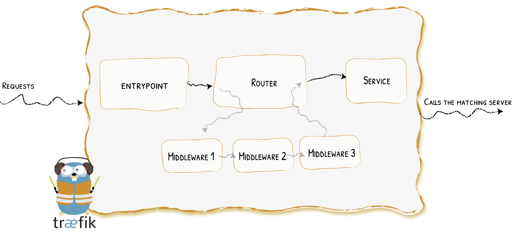

# Traefik Proxy Example

This repository contains a simple and easy example about Traefik Proxy v3 using Docker Compose and Kubernetes.



## Prerequisites

Before getting started, make sure you have the following installed on your machine:

- Docker
- Docker Compose

or

- Kubernetes
- Helm

## Usage

### With Docker-compose

1. Clone this repository to your local machine:

    ```shell
    git clone https://github.com/garovu/traefik-proxy-example.git
    ```

2. Navigate to the project directory:

    ```shell
    cd traefik-proxy-example/docker
    ```

3. Customize the Traefik configuration in the `traefik.yaml` file according to your needs.

4. Start the Traefik proxy:

    ```shell
    docker-compose up -d
    ```

5. Verify that the Traefik proxy is running by accessing the Traefik dashboard at `http://localhost:8080`.

    Checking first example by going to `http:localhost:80` which will be point to the `whoami` container. More about [docker provider](https://doc.traefik.io/traefik/providers/docker/).

6. Start monitoring cluster (just metrics at this time):

    ```shell
    docker-compose -f monitoring-compose -d
    ```

    - Grafana Dashboard: `localhost:3000`

    - Prometheus : `localhost:9090`

7. Stop this compose and remove containers.

    ```shell
    docker-compose down
    docker-compose -f monitoring-compose.yaml down

    ```

### With Kubernetes

- *updating

## Configuration

The `traefik.yaml` file contains the configuration for the Traefik proxy. You can modify this file to customize the proxy behavior, such as adding additional middleware, defining routing rules, or enabling TLS.

For more information on how to configure Traefik, refer to the [official documentation](https://doc.traefik.io/traefik/).

## Contributing

Contributions are welcome! If you have any improvements or bug fixes, feel free to open a pull request.

## License

This project is licensed under the [MIT License](LICENSE).
